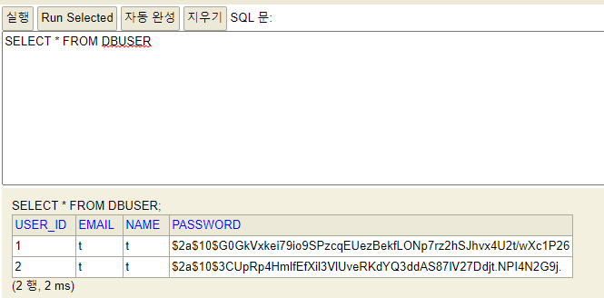

# 1. 프로젝트 설명
* 스프링시큐리티 로그인 구현체를 사용하여 커스텀 로그인 구현

## 1.1 회원가입
* 비밀번호를 암호화하여 저장
    * springsecurity가 제공하는 암호화함수(BCryptPasswordEncoder) 사용
    

<br>회원가입 페이지

<br>


<br>DB에 저장된 회원정보

<br>

## 1.2 커스텀 로그인
* DB에 저장된 회원으로 로그인 구현(UserDetailsService 구현)


<br>로그인 페이지

<br>


<br>DB에 로그인 성공 로그

<br>

# 2. 상세설명
## 2.1 UserDetailService를 implements하여 커스텀 로그인 구현
* springsecurity가 자동으로 username을 인자로 전달
    * username은 login.html form에서 입력한 값
* username을 기준으로 DB에 해당 이름이 있는 계정을 조회
    * DB연동은 JPA사용
* 찾은 계정을 UserDetail로 리턴
```java
@Service
@RequiredArgsConstructor
public class UserService implements UserDetailsService {
    private final UserRepository userRepository;
    private final PasswordEncoder passwordEncoder;
    
    ...

    @Override
    public UserDetails loadUserByUsername(String username) throws UsernameNotFoundException {
        DBUser findUser = userRepository.findByName(username).orElseThrow();
        return UserDetail.builder()
                .user(findUser)
                .build();
    }
}
```

<br>

## 2.2 DB에 저장된 User정보는 UserDetails에 매핑
* springsecurity는 DB를 UserDetails로 관리
* 따라서, 커스텀 로그인을 구현하기 위해서는 UserDetails를 구현 필요
* 구현방법
    * 생성자(Builder패턴)로 User클래스를 초기화
    * name과 password는 User클래스가 가지고 있는 필드를 리턴
    * 계정을 활성화 시키기 위해 나머지는 true리턴 
```java
@NoArgsConstructor
public class UserDetail implements UserDetails {
    private DBUser user;

    @Builder
    public UserDetail(DBUser user) {
        this.user = user;
    }

    @Override
    public Collection<? extends GrantedAuthority> getAuthorities() {
        return null;
    }

    @Override
    public String getPassword() {
        return user.getPassword();
    }

    @Override
    public String getUsername() {
        return user.getName();
    }

    @Override
    public boolean isAccountNonExpired() {
        return true;
    }

    @Override
    public boolean isAccountNonLocked() {
        return true;
    }

    @Override
    public boolean isCredentialsNonExpired() {
        return true;
    }

    @Override
    public boolean isEnabled() {
        return true;
    }
}
```